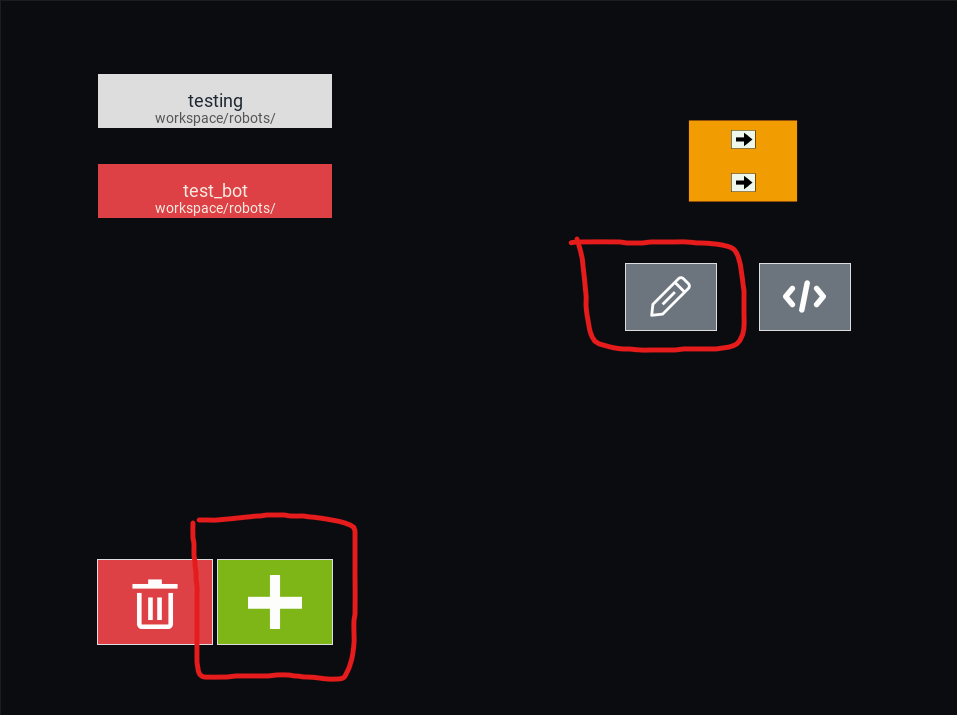

The basics
===========

Now that we've got EV3Sim installed, we can try out a few of the features EV3Sim has on offer.

EV3Sim allows you to design, test and simulate your own bots, all through the application!
The only thing you'll need an external program for is writing the program to be run on your bot.

Designing a bot
---------------
To create a new bot, go to the ``Bots`` menu and click the '+' Button. 
If you want to change the design of an existing bot, you can select that bot and click the pencil icon instead.

If you are creating a new bot, you'll be prompted to pick a baseplate for the bot.
The baseplate is the object that all other components of your robot will rest on. This can be a circle, a regular polygon, or a rectangle.

.. image:: images/baseplate_dialog.png
  :width: 600
  :alt: The baseplate dialog, selecting circle, rectangle or polygon.

After you've created the baseplate for your robot, you can starting adding and removing elements from the baseplate.

Placing elements
^^^^^^^^^^^^^^^^

Before you can place an element, you need to select what type of element you'll be placing.
There are 4 types of elements:

* Circles
* Rectangles
* Regular Polygons
* Devices (Motors, Sensors, Buttons)

Click the respective icon on the left sidebar to select that element. 
If you instead click the cursor icon, you will be return to select mode, where you can select elements already on the bot, and change/remove them.

.. image:: images/bot_edit_holding_elements.png
  :width: 600
  :alt: The bot edit screen highlighting the different placement modes.

After selecting an element type, you can:

1. Edit the properties of your held item in the bottom bar.
2. Click on the bot to place the element at a certain location.

Modifying elements
^^^^^^^^^^^^^^^^^^

To modify an element on the robot, we first need to enter the selecting mode, by clicking the cursor icon on the left sidebar.
Then, click on the element to select it. After this, the bottom bar should populate with properties to edit:

* Rotation
* Fill and Stroke colour
* Radius / Side length / Width
* Device port

And many others. You can edit these properties and see them change in real time on the bot!

Any numerical property can be edited simply by typing out the value you want, after clicking in the box. 
You can also scroll while hovering over the value to increase/decrease it with ease.

The fill and stroke properties can be change by clicking the colour swatch next to it. This should open a colour picker.

The device port entry can be whatever you want it to be, but this property tends to be ``in1,in2,in3...`` for sensors, and ``outA,outB,outC...`` for motors.

.. image:: images/bot_edit_properties.png
  :width: 600
  :alt: The bot select screen highlighting the editing fields for certain elements.

Removing elements
^^^^^^^^^^^^^^^^^

Just as before, enter the selecting mode and select the element.
On the left sidebar, a 'Remove' button should appear, you can press this to delete the element.
Additionally, the backspace key should also remove the element.

Saving the bot
--------------

After you are happy with the components on you bot, you click the Create/Save button on the bottom right.
If you are creating a robot, this will first prompt you for:

* The programming language this bot will use (Mindstorms or Python)
* The name of the robot (This must be a valid filename)

Adding code to a bot
--------------------

After creating your bot, you can press the code icon on the right of the bot menu to edit the code it will run.
If on windows, this will try to detect VSCode / Mindstorms and open it accordingly. Otherwise it will focus the code in a file explorer window.

Using your bot
--------------

Provided you've now created a bot, you can start using it in simulations be going back to the main menu with the Escape button.
From here, select the robot icon next to Soccer.

Now, your bot should show up in the list on the left, click it, then click Select. Finally, click done. This should take you back to the main menu.

From here, you can press "Soccer" to simulate with your robot!

Changing the simulation
-----------------------

When you opened the soccer simulation, you might have noticed that certain rules were enforced, such as halftimes of 5 minutes, and robots being penalised for venturing past the white line.
To change this, we can press the cog icon on the main menu:

After pressing "Soccer" again, you should notice the changes taking effect.

EV3Sim settings
---------------

Lastly, there are some general settings available for ev3sim, such as the FPS, Default screen width and height, as well as disabling/enabling the console in simulation:

.. image:: images/settings_main.png
  :width: 600
  :alt: The main settings menu of EV3Sim.
