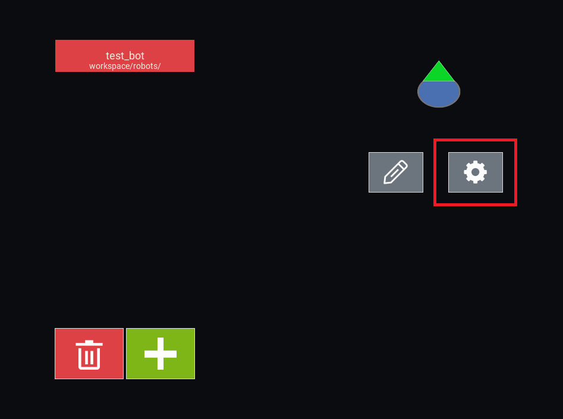
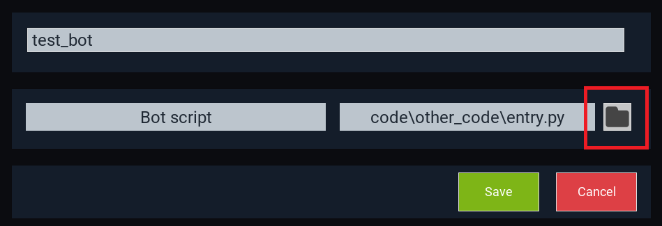

Bot editing
===========

EV3Sim allows you to design, test and simulate your own bots, all through the application!
The only thing you'll want an external program for is writing the code to be run on your bot.

.. TODO: A full video explanation of this system can be found here:

Designing a bot
---------------
To create a new bot, go to the ``Bots`` menu and click the '+' Button. 
If you want to change the design of an existing bot, you can select that bot and click the pencil icon instead.

.. image:: images/bot_menu_edit.png
  :width: 600
  :alt: The bot select screen highlighting the new and edit buttons.

If you have the windows one click install, you can also find your bot in ``workspace/robots`` and right click, select ``Open`` to edit the bot.

If you are creating a new bot, you'll be prompted to pick a baseplate for the bot.
The baseplate is the object that all other components of your robot will rest on. This can be a circle, a regular polygon, or a rectangle.

.. image:: images/baseplate_dialog.png
  :width: 600
  :alt: The baseplate dialog, selecting circle, rectangle or polygon.

After you've created the baseplate for your robot, you can starting adding and removing elements from the baseplate.

Placing elements
^^^^^^^^^^^^^^^^

Before you can place an element, you need to select what type of element you'll be placing.
There are 4 types of elements:

* Circles
* Rectangles
* Regular Polygons
* Devices (Motors, Sensors, Buttons)

Click the respective icon on the left sidebar to select that element. 
If you instead click the cursor icon, you will be return to select mode, where you can select elements already on the bot, and change/remove them.

.. image:: images/bot_edit_holding_elements.png
  :width: 600
  :alt: The bot edit screen highlighting the different placement modes.

After selecting an element type, you can:

1. Edit the properties of your held item in the bottom bar.
2. Click on the bot to place the element at a certain location.

Modifying elements
^^^^^^^^^^^^^^^^^^

To modify an element on the robot, we first need to enter the selecting mode, by clicking the cursor icon on the left sidebar.
Then, click on the element to select it. After this, the bottom bar should populate with properties to edit:

* Rotation
* Fill and Stroke colour
* Radius / Side length / Width
* Device port

And many others. You can edit these properties and see them change in real time on the bot!

Any numerical property can be edited simply by typing out the value you want, after clicking in the box. 
You can also scroll while hovering over the value to increase/decrease it with ease.

The fill and stroke properties can be change by clicking the colour swatch next to it. This should open a colour picker.

The device port entry can be whatever you want it to be, but this property tends to be ``in1,in2,in3...`` for sensors, and ``outA,outB,outC...`` for motors.

.. image:: images/bot_edit_properties.png
  :width: 600
  :alt: The bot select screen highlighting the editing fields for certain elements.

Removing elements
^^^^^^^^^^^^^^^^^

Just as before, enter the selecting mode and select the element.
On the left sidebar, a 'Remove' button should appear, you can press this to delete the element.
Additionally, the backspace key should also remove the element.

Adding code to a bot
--------------------

Designing a good bot also includes designing code to run! You can specify the code location for a specific bot by selecting it in the bot menu and pressing the settings cog.

If you have the windows one click install, you can also find your bot in ``workspace/robots`` and right click, select ``Edit`` to go to the same window.

Then press the button next to 'Bot script' to open the file selector. 
All code you want to run on your bot should be located in the ``code`` folder of your workspace!

