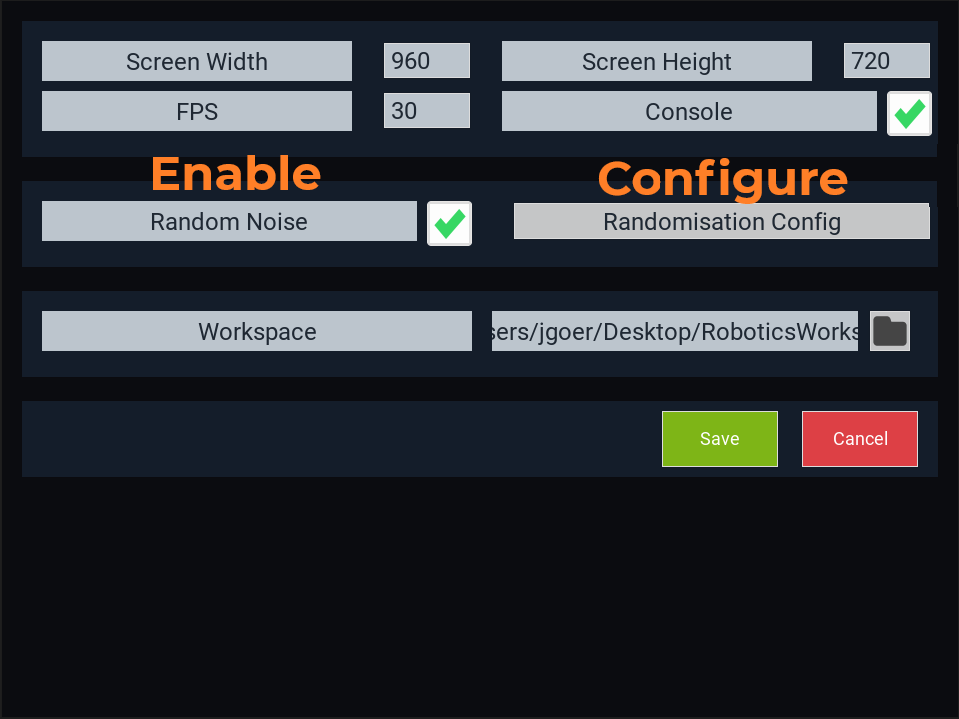
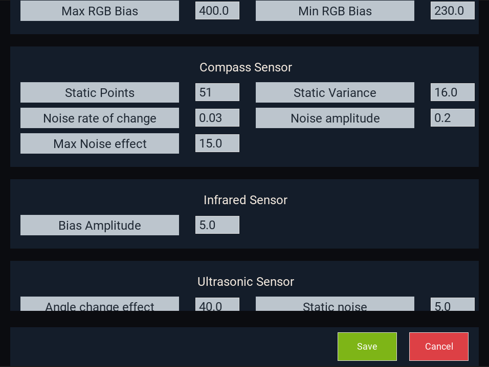

Randomisation
=============

While disabled by default, you can enable some randomisation for device data (to simulate real life issues) By changing the settings of ev3sim:

You can also configure these values to your liking / realism by pressing the button on the right:

In general, the following rules occur to device randomness:

* Internal biases of devices will be static on the same port / robot filename.
* Randomness which is introduced over time or every game tick is tied to the seed, and so different every time.
