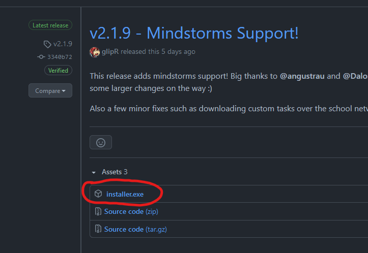

Setting up and Running EV3Sim
=============================

Requirements
------------

Depending on how you want to use EV3Sim, different additional software may be required.

If you want your robots to run Python code, `VSCode`_ is highly recommended to edit this python code. 
We say this as we have made many integrations with VSCode to make using VSCode + Python a very simple experience.

On the other hand, if you want your robots to run Mindstorms programs, you'll need to install the `Mindstorms EV3 Home App`_.

Installation
------------

Windows Executable
^^^^^^^^^^^^^^^^^^

By far the easiest way to install and use EV3Sim if you have a windows computer is using the one-click installer available on the `releases page on github`_.

.. TODO: Change image.

Simply download the asset file named ``installer.exe``, and follow the prompts to get ev3sim installed.

Pip install
^^^^^^^^^^^

If installing via this method, EV3sim requires Python 3.9+ to be installed on your system. If you don't already have Python installed, you can download it from https://www.python.org/ .

You can install this package using pip as follows:

.. code-block:: bash

    python -m pip install -U ev3sim

(This command also updates EV3Sim if you already have it installed.)

Starting EV3Sim
---------------

Depending on you installation method, you will start EV3Sim differently:

* If you installed on windows with the one click install, EV3Sim should appear in your start menu.
* If installed via pip, then run ``ev3sim`` in the command line.

Running EV3Sim
--------------

The main menu of EV3Sim contains a few buttons

* The ``Soccer / Rescue`` buttons allow you to run simulations, as well as set the bots and settings in these simulations.
* The ``Bots`` tab allows you to edit and create bots to use in the simulation.
* The ``Settings`` tab allows you to change a few configurations when running EV3Sim.

Each of these sections are covered in further detail in subsequent pages.

Further Information on installing
---------------------------------

Windows
^^^^^^^

Command not recognised
""""""""""""""""""""""

.. code-block:: batch

    'pip' is not recognized as an internal or external command, operable program, or batch file

Make sure you install python with the "Add python to PATH" option selected. This makes sure that the windows command line will understand the python and pip commands. For more information, see https://docs.python.org/3/using/windows.html#installation-steps

EV3Sim runs, but no pygame window is created
""""""""""""""""""""""""""""""""""""""""""""

This is a known issue with pygame. A possible cause is not having the English (US) Language pack in windows installed. This should install itself after a few minutes, once you've installed the package, but if that doesn't occur, you may wish to try manually installing it.

Unix
^^^^

Dependancy or binary package errors
"""""""""""""""""""""""""""""""""""

Pygame requires binary dependencies that aren't always installed by default.

Debian/Ubuntu/Mint

``sudo apt-get install python3-pygame``

Redhat/CentOS

``sudo yum install python3-pygame``

Arch 

``sudo pacman -S python-pygame``

.. _releases page on github: https://github.com/MelbourneHighSchoolRobotics/ev3sim/releases

.. _VSCode: https://code.visualstudio.com/

.. _Mindstorms EV3 Home App: https://www.lego.com/en-au/themes/mindstorms/downloads